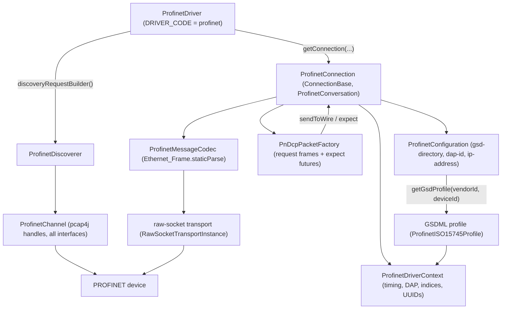

<!--
  Licensed to the Apache Software Foundation (ASF) under one
  or more contributor license agreements.  See the NOTICE file
  distributed with this work for additional information
  regarding copyright ownership.  The ASF licenses this file
  to you under the Apache License, Version 2.0 (the
  "License"); you may not use this file except in compliance
  with the License.  You may obtain a copy of the License at

      https://www.apache.org/licenses/LICENSE-2.0

  Unless required by applicable law or agreed to in writing,
  software distributed under the License is distributed on an
  "AS IS" BASIS, WITHOUT WARRANTIES OR CONDITIONS OF ANY
  KIND, either express or implied.  See the License for the
  specific language governing permissions and limitations
  under the License.
  -->

# Profinet (NG) - Implementation Architecture

This document describes how the `profinet-ng` driver is put together in code.
For the protocol side of things - connection strings, GSD device profiles, DAPs and how the
connection auto-configures itself from `RealIdentificationData` - see [README.md](README.md).

## 1. Overview

The repository contains two PROFINET drivers:

- `plc4j/drivers/profinet` - the legacy module. Each device is driven by its own loop and an
  explicit state machine (`ProfinetDeviceState.SET_IP`, `IDLE`, `APPLRDY`, `CYCLICDATA`,
  `ABORT`, ... in `device/ProfinetDevice.java`), and it talks to the wire through its own
  pcap4j-based `device/ProfinetChannel`, not through a PLC4X transport.
- `plc4j/drivers/profinet-ng` (`plc4j-driver-profinet-ng`) - the newer module. The same protocol,
  ported onto the new SPI `ConnectionBase` model: the connection sits on a PLC4X raw-socket
  transport, and the old fluent `ConversationContext` chains are replaced by a small
  send/expect primitive pair backed by `CompletableFuture`s.

Both register the protocol code `profinet`. Everything below describes `profinet-ng`; all paths
are relative to `plc4j/drivers/profinet-ng/src/main/java/org/apache/plc4x/java/profinet/`.

## 2. Driver registration and entry point - `ProfinetDriver`

`ProfinetDriver` extends the SPI `DriverBase`:

- `DRIVER_CODE = "profinet"` is returned from `getProtocolCode()`; `getProtocolName()` returns
  `"Profinet"`.
- The only supported transport is `raw-socket`: both `getDefaultTransportCode()` and
  `getSupportedTransportCodes()` say so, and `getTransportConfigurationClass(...)` maps it to
  `config/ProfinetRawSocketTransportConfiguration` (which defaults the UDP port to 34964).
- `canSubscribe()`, `canBrowse()` and `canDiscover()` all return `true`. There is no read/write
  support - PROFINET IO data is cyclic, so it is exposed through the subscription API.
- `getConfigurationClass()` returns `config/ProfinetConfiguration`.
- `getConnection(configuration, transportInstance, auditLog)` builds a `ProfinetConnection`.
- `prepareTag(query)` delegates to `ProfinetTag.of(query)`.
- `discoveryRequestBuilder()` does *not* use the per-connection transport. It opens its own pcap4j
  handles over `Pcaps.findAllDevs()` via `channel/ProfinetChannel` and wraps a
  `discovery/ProfinetDiscoverer` in a `DefaultPlcDiscoveryRequest.Builder`.

`ProfinetDriver.MAC_ADDRESS` is the pattern used to recognise a MAC address in a connection string.

## 3. Configuration - `config/ProfinetConfiguration`

Three connection-string parameters:

| Parameter | Field | Notes |
| --- | --- | --- |
| `gsd-directory` | `gsdDirectory` | `@Required`, `@StringDefaultValue("~/.gsd")` |
| `dap-id` | `dapId` | optional; pins the Device Access Point explicitly |
| `ip-address` | `ipAddress` | optional; used when the device is addressed by MAC |

`getGsdProfile(vendorId, deviceId)` expands a leading `~` to `user.home`, then iterates the
directory with a `DirectoryStream`, deserialising each file with Jackson's `XmlMapper` into a
`gsdml/ProfinetISO15745Profile`. A file only counts if its profile header says
`ProfileIdentification == "PROFINET Device Profile"` and `ProfileClassID == "Device"`; the vendor
and device ids from `ProfileBody/DeviceIdentity` are parsed as hex (skipping the `0x` prefix) and
compared against the arguments. Files that fail to parse are skipped silently; an unreadable
directory raises a `RuntimeException`. Returns `null` when nothing matches.

`config/ProfinetRawSocketTransportConfiguration` extends the generic raw-socket transport
configuration and only overrides `getDefaultPort()` with `PROFINET_UDP_PORT = 34964`.

## 4. Connection lifecycle - `ProfinetConnection`

`ProfinetConnection extends ConnectionBase<ProfinetConfiguration> implements ProfinetConversation`.

### `onConnect()`

1. Requires a `RawSocketTransportInstance` - anything else throws a `PlcConnectionException`.
2. Caches the endpoint data the packet factory needs: local and remote `MacAddress` from the
   transport, and the local IPv4 address (an interface without a 4-byte IPv4 address is rejected).
   The remote IP comes from the `ip-address` parameter if present, otherwise it defaults to
   `0.0.0.0`, since L2 addressing during the implicit-communication phase only needs the MAC.
3. Creates the `ProfinetMessageCodec` over the transport with `this::handleIncomingFrame` as the
   message handler, and starts the receive loop via `startReceiving(...)`, which repeatedly calls
   `messageCodec.processIncomingData()`.
4. Runs `doHandshake()` and waits at most **60 seconds** for it. On any failure the connection is
   closed and a `PlcConnectionException` is thrown; only a fully successful handshake flips the
   `connected` flag.

`isConnected()` is `connected && messageCodec != null && messageCodec.isOpen()`.
`close()` clears the flag, shuts down the scheduler, stops receiving, closes the codec and drops
all pending frame listeners.

`getTagHandler()` returns a `tag/ProfinetTagHandler`; `getValueHandler()` returns the SPI
`DefaultPlcValueHandler`.

### `doHandshake()`

An entirely asynchronous `CompletableFuture<Void>` chain:

1. `PnDcpPacketFactory.sendIdentificationRequest(this, localMac, remoteMac)` - a PN-DCP identify
   request, addressed to the device's MAC rather than the discovery multicast address.
2. `extractBlockInfo(...)` reads the `PnDcp_Block`s of the response into the driver context, keyed
   by `option-suboption`: device type (`DEVICE_PROPERTIES_OPTION-1`), name of station (`-2`),
   vendor/device id (`-3`) and device roles (`-4`). A zero vendor or device id fails the handshake.
3. `configuration.getGsdProfile(vendorId, deviceId)` looks up the GSDML profile; no match fails the
   handshake.
4. `applyConfiguredDap(...)`: if `dap-id` was given, the matching DAP (case-insensitive on
   `getId()`) is put into the context; otherwise a profile with exactly one DAP selects that one.
   An empty DAP list fails the handshake.
5. `resolveRealIdentification(...)` builds the `TextId -> value` mapping from the profile's
   `ExternalTextList` and issues
   `PnDcpPacketFactory.sendRealIdentificationDataRequest(this, driverContext)`. If the device
   rejects the call, the already-configured DAP is used, and if there is none the handshake fails
   with "please provide the 'dap-id' parameter". On success `indexModulesFromRealIdentification(...)`
   runs, and a still-unresolved DAP fails with the auto-detect variant of the same message.

### `indexModulesFromRealIdentification(...)`

Flattens the `PnIoCm_Block_RealIdentificationData` APIs into
`slot -> moduleIdentNumber` and `slot -> subslot -> submoduleIdentNumber` maps, then:

- Slot 0 carries the DAP's module ident number (a missing/zero value throws). The DAP whose
  GSDML `ModuleIdentNumber` matches is stored in the context; if it disagrees with a `dap-id` from
  the connection string, a warning is logged and the device's choice wins.
- For every other slot, the matching `ProfinetModuleItem` from the profile's module list goes into
  `moduleIndex`, and each subslot's matching `ProfinetVirtualSubmoduleItem` from the module's
  virtual submodule list goes into `submoduleIndex` (`slot -> subslot -> submodule`). While
  indexing, `replaceTextIds(...)` swaps the input/output data items' `TextId` references for their
  resolved human-readable text.

Both maps are handed to the driver context and are what `onBrowse(...)` and `onSubscribe(...)`
later work from. `onBrowse(...)` walks `submoduleIndex` and emits a `DefaultPlcBrowseItem` per data
item, per direction, with `CYCLIC` subscription support advertised for inputs only.

## 5. Conversation primitives - `ProfinetConversation` and `PnDcpPacketFactory`

`packets/ProfinetConversation` is the minimal interface the packet factory codes against:
`getLocalMacAddress()`, `getRemoteMacAddress()`, `getLocalIp()`, `getRemoteIp()`,
`sendToWire(Ethernet_Frame)` and `expect(Predicate<Ethernet_Frame>, Duration)`.

`ProfinetConnection` implements it:

- `sendToWire(frame)` serialises the frame into a `WriteBufferByteBased` sized by
  `frame.getLengthInBytes()` and hands the bytes to `transportInstance.write(...)`; failures are
  wrapped in a `PlcRuntimeException`.
- `expect(predicate, timeout)` registers a one-shot `FrameListener` (a record of predicate +
  future) in a `CopyOnWriteArrayList`, and schedules a timeout on a single daemon thread
  (`profinet-scheduler`) that fails the future with a `TimeoutException`. Completing the future
  cancels the timeout and deregisters the listener.
- `handleIncomingFrame(frame)` walks the listener list and completes the first matching one.
  Unmatched frames go to `decodeUnmatched(frame)`, which answers `PnIoCm_Packet_Ping` via
  `PnDcpPacketFactory.sendPingResponse(...)` (the AR is torn down otherwise), closes the connection
  on `PnIoCm_Packet_ConnectionlessCancel`, and otherwise just logs at debug level.

`packets/PnDcpPacketFactory` is the port of the old
`sendRequest().expectResponse()...handle()` chains: each `sendXxx(...)` method registers the
`expect(...)` future *first*, then calls `sendToWire(...)`, then unwraps the matched frame into a
typed result. Its default timeout is 6000 ms. The set of exchanges:

| Method | DCE-RPC operation / PDU | Result |
| --- | --- | --- |
| `createIdentificationRequest` / `sendIdentificationRequest` | PN-DCP `PnDcp_Pdu_IdentifyReq` (VLAN-wrapped) | `PnDcp_Pdu_IdentifyRes` |
| `sendReadIAndM0BlockRequest` | `READ_IMPLICIT`, index `0xAFF0` | `PnIoCm_Block_IAndM0` |
| `sendReadIAndM1BlockRequest` | `READ_IMPLICIT`, index `0xAFF1` | `PnIoCm_Block_IAndM1` |
| `sendRealIdentificationDataRequest` | `READ_IMPLICIT`, index `0xF000` | `PnIoCm_Block_RealIdentificationData` (a `PnIoCm_Packet_Rej` fails the future) |
| `sendParameterEndRequest` | `CONTROL` with `PnIoCm_Control_Request_ParameterEnd` | `PnIoCm_Control_Response_ParameterEnd` |
| `sendApplicationReadyResponse` | `CONTROL` response with `PnIoCm_Control_Response_ApplicationReady` | fire-and-forget |
| `sendPingResponse` | `WORKING` packet echoing the ping's UUIDs | fire-and-forget |

Helpers: `unwrapVlan(...)` peels `Ethernet_FramePayload_VirtualLan`, `isIPv4DceRpcResponse(...)`
type-checks the DCE-RPC payload, and `wrapAsUdpEthernet(...)` builds the
`Ethernet_FramePayload_IPv4` (random identification, TTL 64) and the outer `Ethernet_Frame`.

## 6. Connect request / AR setup - the subscribe flow

`onSubscribe(PlcSubscriptionRequest)` is where the application relation (AR) is established. With
no DAP resolved it fails immediately. Otherwise:

1. `groupTagsBySlot(...)` sorts the requested `ProfinetTag`s into
   `slot -> subslot -> direction -> index`.
2. Four hard-coded DAP objects (subslots `0x1`, `0x8000`, `0x8001`, `0x8002` in slot 0) seed the
   input data objects / output IOCS lists and the first
   `PnIoCm_Block_ExpectedSubmoduleReq` - a TODO carried over from the original driver, which should
   derive these from the GSD file.
3. `buildSlotSubmodules(...)` walks each slot, reads `IocsLength`/`IopsLength` from the indexed
   submodule (defaulting to 1), accumulates input/output frame offsets, and appends one
   `PnIoCm_Submodule_{NoInputNoOutputData,InputData,OutputData,InputAndOutputData}` per subslot
   depending on the directions requested. Data lengths come from
   `getDataTypeLengthInBytes(PlcValueType) * numElements`.
4. `buildConnectRequestFrame(...)` assembles the DCE-RPC `CONNECT` request:
   - `PnIoCm_Block_ArReq` - `IO_CONTROLLER` AR, the context's AR UUID and session key, the local
     MAC, the CM initiator object UUID, `PnIoCm_State.ACTIVE`,
     `DEFAULT_ACTIVITY_TIMEOUT` (600), `UDP_RT_PORT` and the station name `"plc4x"`.
   - `PnIoCm_Block_AlarmCrReq` - alarm CR on `UDP_RT_PORT`.
   - `PnIoCm_Block_IoCrReq` blocks via `buildIoCrBlock(...)`: `INPUT_CR` (id base `0x0001`) and
     `OUTPUT_CR` (`0x0002`), each `RT_CLASS_2`, `DEFAULT_IO_DATA_SIZE` (40), frame id
     `0x8000 | getAndIncrementIdentification()`, and the context's send-clock factor, reduction
     ratio, watchdog factor and data-hold factor.
   - the expected-submodule blocks built above.

   These go into a `PnIoCm_Packet_Req` inside a `DceRpc_Packet` with
   `DceRpc_Operation.CONNECT`, big-endian integer encoding, a
   `DceRpc_InterfaceUuid_DeviceInterface` and the context's activity UUID, wrapped in an
   `Ethernet_FramePayload_IPv4` from `localPort` to `remotePortImplicitCommunication` and finally
   an `Ethernet_Frame` from the local to the remote MAC.
5. The connection registers an `expect(...)` for a DCE-RPC `RESPONSE` (1 s timeout), sends the
   connect request, and on the response: registers a second `expect(...)` for the device's
   `PnIoCm_Control_Request_ApplicationReady` request (500 s timeout) and fires
   `PnDcpPacketFactory.sendParameterEndRequest(...)` in parallel - the device sends
   `ApplicationReady` within a few milliseconds, so waiting for the ParameterEnd response first
   would risk missing it. When `ApplicationReady` arrives, its AR UUID and session key are echoed
   back with `PnDcpPacketFactory.sendApplicationReadyResponse(...)`.

`onUnsubscribe(...)` completes with an empty `DefaultPlcUnsubscriptionResponse`.

## 7. Message codec - `ProfinetMessageCodec`

`ProfinetMessageCodec extends MessageCodecBase<Ethernet_Frame>` and is deliberately thin. PROFINET
runs directly over Ethernet (EtherType `0x8892` for PN-DCP, plus IPv4/UDP for the DCE-RPC based
PN-CM traffic), and the raw-socket transport configured with `include-ethernet-header=true`
delivers each captured frame as one self-contained block and accepts pre-built frames on write.
So the codec is a 1:1 wrapper around `Ethernet_Frame.staticParse(readBuffer)`:

- `getMinimumHeaderSize()` returns `14` (dst + src + ethertype) - just enough for the base class to
  decide a frame exists.
- `calculateTotalMessageSize(header, availableBytes)` returns everything currently available, since
  there is no streaming framing to reassemble.

## 8. Driver context - `context/ProfinetDriverContext`

Per-connection mutable state. Under the old SPI this was the `DriverContext`; now the connection
simply owns one instance.

Constants:

| Constant | Value |
| --- | --- |
| `DEFAULT_UDP_PORT` | `34964` |
| `UDP_RT_PORT` | `0x8892` |
| `DEFAULT_ARGS_MAXIMUM` / `DEFAULT_MAX_ARRAY_COUNT` | `16696` |
| `DEFAULT_ACTIVITY_TIMEOUT` | `600` |
| `BLOCK_VERSION_HIGH` / `BLOCK_VERSION_LOW` | `1` / `0` |
| `DEFAULT_IO_DATA_SIZE` | `40` |
| `DEFAULT_EMPTY_MAC_ADDRESS` | `00:00:00:00:00:00` |

State:

- Device identity discovered by PN-DCP: `deviceType`, `deviceName`, `roles`, `vendorId`, `deviceId`.
- Timing parameters used when building the IO CR blocks: `sendClockFactor = 32`,
  `reductionRatio = 16`, `watchdogFactor = 3`, `dataHoldFactor = 3` (roughly half the resulting
  time is the interval at which the device sends data).
- AR setup: `advancedStartupMode = true`, `sessionKey = 1`.
- Device model: the selected `dap`, plus `moduleIndex` (`slot -> ProfinetModuleItem`) and
  `submoduleIndex` (`slot -> subslot -> ProfinetVirtualSubmoduleItem`).
- Ports: `localPort` and `remotePortImplicitCommunication`, both initialised to
  `DEFAULT_UDP_PORT`.
- PN-CM identifiers: a random `DceRpc_ActivityUuid` (`generateActivityUuid()`) and a random AR
  `Uuid` (`generateApplicationRelationUuid()`), both created in the constructor;
  `getCmInitiatorObjectUuid()` derives a `DceRpc_ObjectUuid` from the vendor/device id; and
  `getAndIncrementIdentification()` hands out DCE-RPC sequence/frame identifiers from an
  `AtomicInteger`, wrapping back to 1 at `0xFFFF`.

## 9. Tag addressing - `tag/ProfinetTag`

Address format:

    {slot}.{subSlot}.{INPUT|OUTPUT}.{index}[selection]:{TYPE}

for example `1.2.INPUT.0[0..3]:INT`. `ProfinetTag.ADDRESS_PATTERN` captures `slot`, `subSlot`,
`direction` (the `Direction` enum: `INPUT` or `OUTPUT`), `index`, the shared
`ArrayNotationParser.ARRAY_GROUP` selection and `dataType` (a `PlcValueType` name).

`ProfinetTag.of(addressString)` parses it and enforces the edge cases the pattern cannot:

- a missing index (optional in the regex, but always required in practice) raises a
  `PlcInvalidTagException` naming the expected format;
- an array selection must start at the first element - this driver addresses a named variable,
  not an offset, so `[2..5]` is rejected rather than silently ignored;
- `[4]` and `[4..4]` both select one element, but only the second is a range, so the parsed tag
  keeps an `explicitRange` flag and `getArrayInfo()` reports a `DefaultArrayInfo` only for ranges.

`tag/ProfinetTagHandler.parseTag(...)` just delegates to `ProfinetTag.of(...)`
(`parseQuery(...)` is not implemented yet). `utils/ProfinetDataTypeMapper` maps a GSDML
`ProfinetDataItem` to a `PlcValueType` plus element count, and is what `onBrowse(...)` uses to
synthesise browse tags.

## 10. Discovery - `discovery/ProfinetDiscoverer`

`ProfinetDiscoverer implements PlcDiscoverer` and works off the pcap4j handles held by
`channel/ProfinetChannel` (opened by `ProfinetDriver.discoveryRequestBuilder()` across all
interfaces), registering `handleIncomingPacket` as a packet listener in its constructor.

- `sendPnDcpDiscoveryRequest()` builds the same identify request as the handshake via
  `PnDcpPacketFactory.createIdentificationRequest(...)`, but addressed to the PROFINET
  multicast MAC `PROFINET_BROADCAST_MAC_ADDRESS = 01:0E:CF:00:00:00`, serialises it and sends it on
  every open handle. A "Network is down" `PcapNativeException` (a disabled Wi-Fi interface, say) is
  ignored; anything else propagates.
- `setDiscoveryEndTimer(request, 10000L)` completes the `PlcDiscoveryResponse` after 10 seconds
  with everything collected so far, breaking and closing all pcap handles first.
- `handlePnDcpPacket(...)` processes `PnDcp_Pdu_IdentifyRes` PDUs: the blocks are keyed by
  `option-suboption` (`DEVICE_TYPE_NAME`, `DEVICE_NAME_OF_STATION`, `DEVICE_ID`, `DEVICE_ROLE`,
  `IP_OPTION_IP`, ...) and turned into a `DefaultPlcDiscoveryItem` for driver code
  `ProfinetDriver.DRIVER_CODE` on transport `raw-socket`, with attributes `ipAddress`,
  `subnetMask`, `macAddress`, `localMacAddress`, `deviceTypeName`, `deviceName`, `vendorId`,
  `deviceId`, `role` and `packetType`. A device that still reports `0.0.0.0` needs an IP assigned by
  the master, so its MAC is used as the connection address and an `ip-address` option placeholder is
  added. Items are collected and, if a `PlcDiscoveryItemHandler` was passed to
  `discoverWithHandler(...)`, streamed to it as they arrive.

## 11. Known gaps / caveats

Both of these are carried over verbatim from the driver this module was ported from, and are
called out in the `ProfinetConnection` class Javadoc and in TODO comments in the subscribe path:

- **The subscription response future is never completed.** `onSubscribe(...)` returns a
  `CompletableFuture<PlcSubscriptionResponse>` that is only ever completed *exceptionally*. The
  CONNECT handshake runs to completion and the AR is established, but once the device's
  `ApplicationReady` has been acknowledged the code merely logs a warning instead of completing the
  future with a `PlcSubscriptionResponse`.
- **Cyclic IO frames are not dispatched.** Incoming frames that match no pending `expect(...)`
  listener fall into `decodeUnmatched(...)`, which only answers pings and handles connection
  cancellation; cyclic IO data is logged at debug level and dropped. Consistently,
  `onRegisterConsumer(...)` throws `UnsupportedOperationException` - no consumer can receive
  `PlcSubscriptionEvent`s today.
